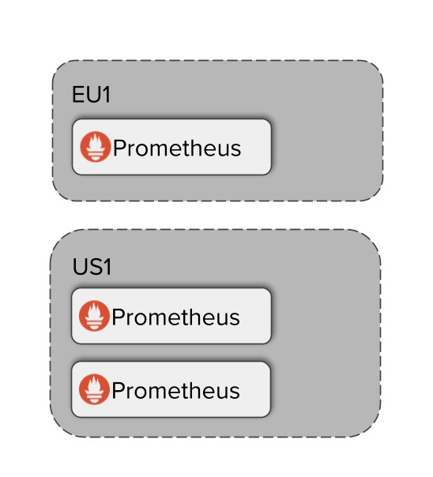

# Global view and seamless HA for prometheus

>This tutorial will take us from transforming vanilla Prometheus to basic Thanos deployment enabling:
>- Reliable querying multiple Prometheus instances from single [Prometheus API endpoint](https://prometheus.io/docs/prometheus/latest/querying/api/#expression-queries).
>- Seamless handling of Highly Available Prometheus (multiple replicas)


## Initial Prometheus Setup

### Step 1 - Start initial Prometheus servers

 Thanos is meant to scale and extend vanilla Prometheus. This means that you can gradually, without disruption, deploy Thanos on top of your existing Prometheus setup.

Let's start our tutorial by spinning up three Prometheus servers. Why three? The real advantage of Thanos is when you need to scale out Prometheus from a single replica. Some reason for scale-out might be:

- Adding functional sharding because of metrics high cardinality
- Need for high availability of Prometheus e.g: Rolling upgrades
- Aggregating queries from multiple clusters

For this course, let's imagine the following situation:



1. We have one Prometheus server in some `eu1` cluster.
2. We have 2 replica Prometheus servers in some `us1` cluster that scrapes the same targets.

Let's start this initial Prometheus setup for now.

## Prometheus Configuration Files

Now, we will prepare configuration files for all Prometheus instances.First, for the EU Prometheus server that scrapes itself:

prometheus0_eu1.yaml

```yaml
global:
  scrape_interval: 15s
  evaluation_interval: 15s
  external_labels:
    cluster: eu1
    replica: 0

scrape_configs:
  - job_name: 'prometheus'
    static_configs:
      - targets: ['127.0.0.1:9090']
```

prometheus0_us1.yaml

```yaml
global:
  scrape_interval: 15s
  evaluation_interval: 15s
  external_labels:
    cluster: us1
    replica: 0

scrape_configs:
  - job_name: 'prometheus'
    static_configs:
      - targets: ['127.0.0.1:9091','127.0.0.1:9092']
```

prometheus1_us1.yaml

```yaml
global:
  scrape_interval: 15s
  evaluation_interval: 15s
  external_labels:
    cluster: us1
    replica: 1

scrape_configs:
  - job_name: 'prometheus'
    static_configs:
      - targets: ['127.0.0.1:9091','127.0.0.1:9092']
```

**NOTE** : Every Prometheus instance must have a globally unique set of identifying labels. These labels are important as they represent certain "stream" of data (e.g in the form of TSDB blocks). Within those exact external labels, the compactions and downsampling are performed, Querier filters its store APIs, further sharding option, deduplication, and potential multi-tenancy capabilities are available. Those are not easy to edit retroactively, so it's important to provide a compatible set of external labels as in order to for Thanos to aggregate data across all the available instances.

## Starting Prometheus Instances

Let's now start three containers representing our three different Prometheus instances.

Please note the extra flags we're passing to Prometheus:

- `--web.enable-admin-api` allows Thanos Sidecar to get metadata from Prometheus like `external labels`.
- `--web.enable-lifecycle` allows Thanos Sidecar to reload Prometheus configuration and rule files if used.

Execute following commands:

### Prepare "persistent volumes"

```shell
$ mkdir -p prometheus0_eu1_data prometheus0_us1_data prometheus1_us1_data
```

### Deploying "EU1"

```shell
docker run -d --net=host --rm \
    -v $(pwd)/prometheus0_eu1.yml:/etc/prometheus/prometheus.yml \
    -v $(pwd)/prometheus0_eu1_data:/prometheus \
    -u root \
    --name prometheus-0-eu1 \
    quay.io/prometheus/prometheus:v2.14.0 \
    --config.file=/etc/prometheus/prometheus.yml \
    --storage.tsdb.path=/prometheus \
    --web.listen-address=:9090 \
    --web.external-url=https://2886795274-9090-elsy04.environments.katacoda.com \
    --web.enable-lifecycle \
    --web.enable-admin-api && echo "Prometheus EU1 started!"
```

NOTE: We are using the latest Prometheus image so we can take profit from the latest remote read protocol.

### Deploying "US1"

```
docker run -d --net=host --rm \
    -v $(pwd)/prometheus0_us1.yml:/etc/prometheus/prometheus.yml \
    -v $(pwd)/prometheus0_us1_data:/prometheus \
    -u root \
    --name prometheus-0-us1 \
    quay.io/prometheus/prometheus:v2.14.0 \
    --config.file=/etc/prometheus/prometheus.yml \
    --storage.tsdb.path=/prometheus \
    --web.listen-address=:9091 \
    --web.external-url=https://2886795274-9091-elsy04.environments.katacoda.com \
    --web.enable-lifecycle \
    --web.enable-admin-api && echo "Prometheus 0 US1 started!"
```

and

```
docker run -d --net=host --rm \
    -v $(pwd)/prometheus1_us1.yml:/etc/prometheus/prometheus.yml \
    -v $(pwd)/prometheus1_us1_data:/prometheus \
    -u root \
    --name prometheus-1-us1 \
    quay.io/prometheus/prometheus:v2.14.0 \
    --config.file=/etc/prometheus/prometheus.yml \
    --storage.tsdb.path=/prometheus \
    --web.listen-address=:9092 \
    --web.external-url=https://2886795274-9092-elsy04.environments.katacoda.com \
    --web.enable-lifecycle \
    --web.enable-admin-api && echo "Prometheus 1 US1 started!"
```

## Setup Verification

Once started you should be able to reach all of those Prometheus instances:

- [Prometheus-0 EU1](https://2886795274-9090-elsy04.environments.katacoda.com/)
- [Prometheus-1 US1](https://2886795274-9091-elsy04.environments.katacoda.com/)
- [Prometheus-2 US1](https://2886795274-9092-elsy04.environments.katacoda.com/)

## Additional info

Why would one need multiple Prometheus instances?

- High Availability (multiple replicas)
- Scaling ingestion: Functional Sharding
- Multi cluster/environment architecture

## Problem statement: Global view challenge

Let's try to play with this setup a bit. You are free to query any metrics, however, let's try to fetch some certain information from our multi-cluster setup: **How many series (metrics) we collect overall on all Prometheus instances we have?**

Tip: Look for `prometheus_tsdb_head_series` metric.

🕵️‍♂️

Try to get this information from the current setup!

To see the answer to this question click SHOW SOLUTION below.

## Next

Great! We have now running 3 Prometheus instances.

In the next steps, we will learn how we can install Thanos on top of our initial Prometheus setup to solve problems shown in the challenge.

#### Thanos Sidecars

# Step 2 - Installing Thanos sidecar

Let's take the setup from the previous step and seamlessly install Thanos to add Global View with HA handling feature.

## Thanos Components

Thanos is a single Go binary capable to run in different modes. Each mode represents a different component and can be invoked in a single command.

Let's take a look at all the Thanos commands:

```
docker run --rm quay.io/thanos/thanos:v0.24.0 --help
```

You should see multiple commands that solves different purposes.

In this step we will focus on `thanos sidecar`:

```
  sidecar [<flags>]
    sidecar for Prometheus server
```

## Sidecar

Sidecar as the name suggests should be deployed together with Prometheus. Sidecar has multiple features:

- It exposes Prometheus metrics as a common Thanos [StoreAPI](https://thanos.io/tip/thanos/integrations.md/#storeapi). StoreAPI is a generic gRPC API allowing Thanos components to fetch metrics from various systems and backends.
- It is essentially in further long term storage options described in [next](https://www.katacoda.com/thanos/courses/thanos/1-globalview) courses.
- It is capable to watch for configuration and Prometheus rules (alerting or recording) and notify Prometheus for dynamic reloads:
  - optionally substitute with environment variables
  - optionally decompress if gzipp-ed

You can read more about sidecar [here](https://thanos.io/tip/components/sidecar.md/)

## Installation

To allow Thanos to efficiently query Prometheus data, let's install sidecar to each Prometheus instances we deployed in the previous step as shown below:


For this setup the only configuration required for sidecar is the Prometheus API URL and access to the configuration file. Former will allow us to access Prometheus metrics, the latter will allow sidecar to reload Prometheus configuration in runtime.

Click snippets to add sidecars to each Prometheus instance.

### Adding sidecar to "EU1" Prometheus

```
docker run -d --net=host --rm \
    -v $(pwd)/prometheus0_eu1.yml:/etc/prometheus/prometheus.yml \
    --name prometheus-0-sidecar-eu1 \
    -u root \
    quay.io/thanos/thanos:v0.24.0 \
    sidecar \
    --http-address 0.0.0.0:19090 \
    --grpc-address 0.0.0.0:19190 \
    --reloader.config-file /etc/prometheus/prometheus.yml \
    --prometheus.url http://127.0.0.1:9090 && echo "Started sidecar for Prometheus 0 EU1"
```

### Adding sidecars to each replica of Prometheus in "US1"

```
docker run -d --net=host --rm \
    -v $(pwd)/prometheus0_us1.yml:/etc/prometheus/prometheus.yml \
    --name prometheus-0-sidecar-us1 \
    -u root \
    quay.io/thanos/thanos:v0.24.0 \
    sidecar \
    --http-address 0.0.0.0:19091 \
    --grpc-address 0.0.0.0:19191 \
    --reloader.config-file /etc/prometheus/prometheus.yml \
    --prometheus.url http://127.0.0.1:9091 && echo "Started sidecar for Prometheus 0 US1"
docker run -d --net=host --rm \
    -v $(pwd)/prometheus1_us1.yml:/etc/prometheus/prometheus.yml \
    --name prometheus-1-sidecar-us1 \
    -u root \
    quay.io/thanos/thanos:v0.24.0 \
    sidecar \
    --http-address 0.0.0.0:19092 \
    --grpc-address 0.0.0.0:19192 \
    --reloader.config-file /etc/prometheus/prometheus.yml \
    --prometheus.url http://127.0.0.1:9092 && echo "Started sidecar for Prometheus 1 US1"
```

## Verification

Now, to check if sidecars are running well, let's modify Prometheus scrape configuration to include our added sidecars.

As always click `Copy To Editor` for each config to propagate the configs to each file.

Note that only thanks to the sidecar, all those changes will be immediately reloaded and updated in Prometheus!

```
Copy to Editorglobal:
  scrape_interval: 15s
  evaluation_interval: 15s
  external_labels:
    cluster: eu1
    replica: 0

scrape_configs:
  - job_name: 'prometheus'
    static_configs:
      - targets: ['127.0.0.1:9090']
  - job_name: 'sidecar'
    static_configs:
      - targets: ['127.0.0.1:19090']
Copy to Editorglobal:
  scrape_interval: 15s
  evaluation_interval: 15s
  external_labels:
    cluster: us1
    replica: 0

scrape_configs:
  - job_name: 'prometheus'
    static_configs:
      - targets: ['127.0.0.1:9091','127.0.0.1:9092']
  - job_name: 'sidecar'
    static_configs:
      - targets: ['127.0.0.1:19091','127.0.0.1:19092']
Copy to Editorglobal:
  scrape_interval: 15s
  evaluation_interval: 15s
  external_labels:
    cluster: us1
    replica: 1

scrape_configs:
  - job_name: 'prometheus'
    static_configs:
      - targets: ['127.0.0.1:9091','127.0.0.1:9092']
  - job_name: 'sidecar'
    static_configs:
      - targets: ['127.0.0.1:19091','127.0.0.1:19092']
```

Now you should see new, updated configuration on each Prometheus. For example here in [Prometheus 0 EU1 /config](https://2886795290-9090-frugo01.environments.katacoda.com/config). In the same time [up](https://2886795290-9090-frugo01.environments.katacoda.com/graph?g0.expr=up&g0.tab=1) should show `job=sidecar` metrics.

Since now Prometheus has access to sidecar metrics we can query for [thanos_sidecar_prometheus_up](https://2886795290-9090-frugo01.environments.katacoda.com/graph?g0.expr=thanos_sidecar_prometheus_up&g0.tab=1) to check if sidecar has access to Prometheus.

## Next

Great! Now you should have setup deployed as in the presented image:


In the next step, we will add a final component allowing us to fetch Prometheus metrics from a single endpoint.

#### Thanos Querier

# Step 3 - Adding Thanos Querier

Thanks to the previous step we have three running Prometheus instances with a sidecar each. In this step we will install Thanos Querier which will use sidecars and allow querying all metrics from the single place as presented below:


But before that, let's take a closer look at what the Querier component does:

## Querier

The Querier component (also called "Query") is essentially a vanilla PromQL Prometheus engine that fetches the data from any service that implements Thanos [StoreAPI](https://thanos.io/tip/thanos/integrations.md/#storeapi). This means that Querier exposes the Prometheus HTTP v1 API to query the data in a common PromQL language. This allows compatibility with Grafana or other consumers of Prometheus' API.

Additionally, Querier is capable of deduplicating StoreAPIs that are in the same HA group. We will see how it looks in practice later on.

You can read more about Thanos Querier [here](https://thanos.io/tip/components/query.md/)

## Deploying Thanos Querier

Let's now start the Query component. As you remember [Thanos sidecar](https://thanos.io/tip/components/query.md/) exposes `StoreAPI` so we will make sure we point the Querier to the gRPC endpoints of all our three sidecars:

Click the snippet below to start the Querier.

```
docker run -d --net=host --rm \
    --name querier \
    quay.io/thanos/thanos:v0.24.0 \
    query \
    --http-address 0.0.0.0:29090 \
    --query.replica-label replica \
    --store 127.0.0.1:19190 \
    --store 127.0.0.1:19191 \
    --store 127.0.0.1:19192 && echo "Started Thanos Querier"
```

## Setup verification

Thanos Querier exposes very similar UI to the Prometheus, but on top of many `StoreAPIs you wish to connect to.

To check if the Querier works as intended let's look on [Querier UI Store page](https://2886795290-29090-frugo01.environments.katacoda.com/stores).

This should list all our three sidecars, including their external labels.

## Global view - Not challenging anymore?

Now, let's get back to our challenge from step 1, so finding the answer to **How many series (metrics) we collect overall on all Prometheus instances we have?**

With the querier this is now super simple.

It's just enough to query Querier for [sum(prometheus_tsdb_head_series)](https://2886795290-29090-frugo01.environments.katacoda.com/graph?g0.range_input=1h&g0.expr=sum(prometheus_tsdb_head_series)&g0.tab=1&g1.range_input=5m&g1.expr=prometheus_tsdb_head_series&g1.tab=0)

You should see the single value representing the number of series scraped in both clusters in the current mode.

If we query `prometheus_tsdb_head_series` we will see that we have complete info about all three Prometheus instances:

```
prometheus_tsdb_head_series{cluster="eu1",instance="127.0.0.1:9090",job="prometheus"}
prometheus_tsdb_head_series{cluster="us1",instance="127.0.0.1:9091",job="prometheus"}
prometheus_tsdb_head_series{cluster="us1",instance="127.0.0.1:9092",job="prometheus"}
```

## Handling of Highly Available Prometheus

Now, as you remember we configured Prometheus 0 US1 and Prometheus 1 US1 to scrape the same things. We also connect Querier to both, so how Querier knows what is an HA group?

Try to query the same query as before: [prometheus_tsdb_head_series](https://2886795290-29090-frugo01.environments.katacoda.com/graph?g0.range_input=1h&g0.expr=sum(prometheus_tsdb_head_series)&g0.tab=1&g1.range_input=5m&g1.expr=prometheus_tsdb_head_series&g1.tab=0)

Now turn off deduplication (`deduplication` button on Querier UI) and hit `Execute` again. Now you should see 5 results:

```
prometheus_tsdb_head_series{cluster="eu1",instance="127.0.0.1:9090",job="prometheus",replica="0"}
prometheus_tsdb_head_series{cluster="us1",instance="127.0.0.1:9091",job="prometheus",replica="0"}
prometheus_tsdb_head_series{cluster="us1",instance="127.0.0.1:9091",job="prometheus",replica="1"}
prometheus_tsdb_head_series{cluster="us1",instance="127.0.0.1:9092",job="prometheus",replica="0"}
prometheus_tsdb_head_series{cluster="us1",instance="127.0.0.1:9092",job="prometheus",replica="1"}
```

So how Thanos Querier knows how to deduplicate correctly?

If we would look again into Querier configuration we can see that we also set `query.replica-label` flag. This is exactly the label Querier will try to deduplicate by for HA groups. This means that any metric with exactly the same labels *except replica label* will be assumed as the metric from the same HA group, and deduplicated accordingly.

If we would open `prometheus1_us1.yml` config file in the editor or if you go to Prometheus 1 US1 [/config](https://2886795290-9090-frugo01.environments.katacoda.com/config). you should see our external labels in `external_labels` YAML option:

```yaml
  external_labels:
    cluster: us1
    replica: 1
```

Now if we compare to `prometheus0_us1.yaml`:

```yaml
  external_labels:
    cluster: us1
    replica: 0
```

We can see that since those two replicas scrape the same targets, any metric will be produced twice. Once by `replica=1, cluster=us1` Prometheus and once by `replica=0, cluster=us1` Prometheus. If we configure Querier to deduplicate by `replica` we can transparently handle this High Available pair of Prometheus instances to the user.

## Production deployment

Normally Querier runs in some central global location (e.g next to Grafana) with remote access to all Prometheus-es (e.g via ingress, proxies vpn or peering)

You can also stack (federate) Queriers on top of other Queries, as Query expose `StoreAPI` as well!

More information about those advanced topics can be found in the next courses that will be added soon.

## Next

Awesome! Feel free to play around with the following setup:


